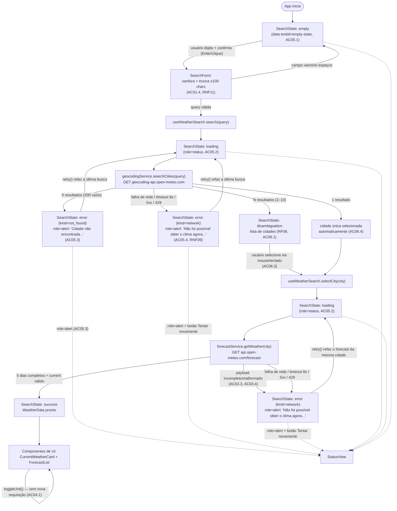

# Plano Técnico — Weather App

> Fonte: [`specs/weather-app-spec.md`](../specs/weather-app-spec.md). Este
> documento traduz a especificação em decisões de arquitetura e contratos
> (tipos/interfaces), sem código de implementação final. Alimenta a quebra
> de tarefas em `tasks/`.

## 1. Architecture Overview

O Weather App é um **SPA client-side puro**, sem backend próprio: o
navegador do usuário chama diretamente a API pública Open-Meteo (RF01–RF06,
Assumptions §7). A arquitetura é organizada em quatro camadas, cada uma com
uma única responsabilidade e uma única direção de dependência (camadas
superiores dependem das inferiores, nunca o contrário):

```text
┌─────────────────────────────────────────────────────────┐
│ Apresentação — UI (src/components)                       │
│  SearchForm · CityDisambiguationList · CurrentWeatherCard│
│  ForecastList · UnitToggle · StatusView (empty/loading/  │
│  error)                                                  │
│  Responsabilidade: renderizar SearchState/Unit recebidos │
│  via props e emitir eventos de usuário. Sem fetch, sem   │
│  regra de negócio.                                       │
└───────────────▲───────────────────────────────┬─────────┘
                 │ props/state                   │ eventos (submit, select,
                 │                                │ toggle, retry)
┌───────────────┴───────────────────────────────▼─────────┐
│ Orquestração/estado — Hooks (src/hooks)                   │
│  useWeatherSearch → orquestra a state machine da busca   │
│  useTemperatureUnit → estado da unidade (Unit: C/F)      │
│  Responsabilidade: decidir *quando* chamar os services e  │
│  *qual* transição de estado aplicar. Não conhece HTML/DOM.│
└───────────────▲───────────────────────────────┬─────────┘
                 │ chamadas                      │ dados tipados
┌───────────────┴───────────────────────────────▼─────────┐
│ Acesso a dados — Services (src/services)                  │
│  geocodingService · forecastService (fetch + parsing +    │
│  timeout/AbortController, isolando toda a rede — Risco 1)│
│  Responsabilidade: única camada que conhece a rede e o    │
│  schema bruto da Open-Meteo; devolve tipos de src/types.  │
└───────────────▲───────────────────────────────┬─────────┘
                 │ HTTPS                         │ JSON
┌───────────────┴───────────────────────────────▼─────────┐
│ Open-Meteo API (geocoding + forecast, externa)           │
└─────────────────────────────────────────────────────────┘

src/types → contratos compartilhados por todas as camadas acima.
src/lib   → funções puras (sem I/O) consumidas por hooks e services:
            sanitização, conversão de unidade, tradução de weather_code.
```

Essa separação atende diretamente RNF05 (manutenibilidade: UI em
`components/`, dados em `services/`, hooks em `hooks/`, tipos em `types/`) e
isola a dependência de rede (Risco 1 da spec) atrás de uma interface de
serviço substituível.

**Por que quatro camadas (e não menos) — impacto direto nos testes:**

- **`components/` (apresentação)**: só recebe dados já prontos via props e
  emite eventos; testável renderizando cada `SearchState` possível com
  Testing Library (`getByRole`/`getByLabelText`), sem precisar mockar rede
  (`testing.instructions.md`).
- **`hooks/` (orquestração/estado)**: concentra a state machine (RF05,
  AC05.5) isolada do DOM; testável com `renderHook`, injetando um
  `geocodingService`/`forecastService` mockado, sem montar nenhum
  componente.
- **`services/` (acesso a dados)**: única camada que faz `fetch`; testável
  mockando `fetch` diretamente, sem depender de React nem de estado.
- **`lib/` (funções puras)**: sem efeitos colaterais nem dependências —
  testável com entrada/saída simples (ex.: `celsiusToFahrenheit(0) === 32`),
  o tipo de teste mais rápido e mais barato de manter.

Cada camada pode ser testada isoladamente com o dublê (stub/mock) mínimo
necessário, sem precisar subir a árvore inteira de componentes nem chamar a
API real — reduzindo flakiness e tempo de execução da suíte.

## 2. Tech Stack

| Camada | Tecnologia | Justificativa |
|---|---|---|
| Linguagem | TypeScript (strict) | Contratos de dados explícitos (Data Model §4), reduz bugs de schema da API externa. |
| UI | React 19 + Vite | Já definido pelo projeto; componentes funcionais + hooks atendem bem a state machine simples exigida por RF05. |
| Estilo | Tailwind CSS (dark glassmorphism) | Convenção já adotada no repositório; utilitário, sem CSS-in-JS adicional. |
| Estado | React hooks nativos (`useReducer`/`useState`), sem lib externa | RF05 exige poucos estados mutuamente exclusivos — um `useReducer` local resolve sem over-engineering (evita Redux/Zustand/Context desnecessários). |
| Dados | Open-Meteo (geocoding + forecast), `fetch` nativo | Já decidido na spec; sem SDK externo, sem API key. |
| Testes unitários | Vitest + Testing Library | Já configurado no projeto (`package.json`). |
| Testes E2E | Playwright (Chromium + WebKit) | Cobre RNF10 (compatibilidade) e RNF08 (breakpoints), com `page.route` para determinismo. |
| Lint/format | Biome | Já configurado no projeto. |
| Gerenciador de pacotes | pnpm | Já configurado no projeto. |

Nenhuma biblioteca de gerenciamento de estado, roteamento ou UI kit é
adicionada: a spec descreve uma única tela com estados bem definidos, o que
não justifica dependências extras (princípio de simplicidade).

## 3. Project Structure

```text
src/
  components/
    SearchForm.tsx            # input + submit, sanitização de entrada (AC01.4)
    CityDisambiguationList.tsx  # lista de até 10 cidades (RF06)
    CurrentWeatherCard.tsx     # clima atual (RF02)
    ForecastList.tsx           # previsão de 5 dias (RF03)
    UnitToggle.tsx             # alternância °C/°F (RF04)
    StatusView.tsx             # estados empty/loading/error (RF05)
  hooks/
    useWeatherSearch.ts        # state machine de busca (RF01, RF05, RF06, RNF12)
    useTemperatureUnit.ts      # estado local da unidade (RF04)
  services/
    geocodingService.ts        # chamada + parsing da API de geocoding
    forecastService.ts         # chamada + parsing da API de forecast
    httpClient.ts               # fetch com timeout/AbortController (RNF09)
  types/
    weather.ts                  # City, CurrentWeather, ForecastDay, WeatherData
    search.ts                   # SearchState, Unit
  lib/
    sanitizeQuery.ts            # sanitização/truncamento de entrada (AC01.4, RNF11)
    temperature.ts              # conversão C↔F (RF04)
    weatherCode.ts               # tabela de tradução weather_code → pt-BR (RF02)
  App.tsx
  main.tsx
tests/
  unit/                         # Vitest + Testing Library
  e2e/                          # Playwright
```

Cada arquivo de componente é responsável por uma única seção da UI (regra de
~150 linhas do `react.instructions.md`); lógica de rede nunca aparece dentro
de componentes; funções de `lib/` nunca importam de `services/`, `hooks/`
ou `components/` (dependência de mão única, de baixo para cima no diagrama
da §1).

## 4. Data Model

### 4.1 Tipos principais

```ts
// src/types/weather.ts

export interface City {
  id: number;            // id retornado pela API de geocoding, usado como key estável em listas
  name: string;          // nome oficial da cidade (grafia da API, ex.: "São Paulo")
  country: string;       // nome do país, exibido na desambiguação (AC06.1)
  admin1?: string;       // estado/região (quando a API não retorna, campo fica ausente)
  latitude: number;      // usada como parâmetro da chamada de forecast
  longitude: number;     // usada como parâmetro da chamada de forecast
  timezone: string;      // fuso horário IANA local da cidade (ex.: "America/Sao_Paulo"), define o "hoje" da previsão (RF03)
}

export interface CurrentWeather {
  temperatureC: number;                  // temperature_2m; sempre presente, base para conversão C↔F (RF04)
  apparentTemperatureC: number | null;    // apparent_temperature; null quando ausente no payload → UI exibe "indisponível" (AC02.4)
  humidityPercent: number | null;         // relative_humidity_2m; null quando ausente (AC02.4)
  windSpeedKmh: number | null;            // wind_speed_10m; null quando ausente (AC02.4)
  weatherCode: number;                    // weather_code (código WMO bruto); traduzido via tabela fixa (§4.3)
}

export interface ForecastDay {
  date: string;             // "YYYY-MM-DD" (daily.time), já no timezone local da cidade, não do dispositivo
  temperatureMinC: number;  // daily.temperature_2m_min do dia
  temperatureMaxC: number;  // daily.temperature_2m_max do dia
  weatherCode: number;      // daily.weather_code do dia; nunca derivado de dados horários (AC03.2)
}

export interface WeatherData {
  city: City;              // cidade confirmada pelo usuário (única ou selecionada na desambiguação)
  current: CurrentWeather; // snapshot do clima atual no momento da consulta
  forecast: ForecastDay[]; // sempre exatamente 5 itens (hoje + 4 dias); payload incompleto é rejeitado, não preenchido (AC03.1, AC03.4)
}
```

### 4.2 Estado de busca (state machine)

```ts
// src/types/search.ts

// "celsius" é o padrão da sessão; "fahrenheit" é a alternativa via toggle (RF04)
export type Unit = "celsius" | "fahrenheit";

export type SearchState =
  | { status: "empty" }
  | { status: "loading"; query: string }
  | { status: "disambiguation"; query: string; options: City[] }
  | { status: "error"; query: string; kind: "not_found" | "network"; message: string }
  | { status: "success"; data: WeatherData };
```

`status` é a única fonte de verdade sobre qual UI renderizar — atende
diretamente AC05.5 (exclusividade de estados), pois nenhum componente decide
visibilidade combinando múltiplas flags booleanas.

### 4.3 Tabela de condição climática (weather_code → pt-BR)

Fixa e única, conforme exigido por RF02. Baseada nos códigos WMO usados pelo
Open-Meteo (`weather_code`):

| Código(s) | Texto pt-BR |
|---|---|
| 0 | Céu limpo |
| 1 | Predominantemente limpo |
| 2 | Parcialmente nublado |
| 3 | Nublado |
| 45, 48 | Névoa |
| 51, 53, 55 | Garoa |
| 56, 57 | Garoa congelante |
| 61, 63, 65 | Chuva |
| 66, 67 | Chuva congelante |
| 71, 73, 75, 77 | Neve |
| 80, 81, 82 | Pancadas de chuva |
| 85, 86 | Pancadas de neve |
| 95 | Trovoada |
| 96, 99 | Trovoada com granizo |
| outro/desconhecido | Condição desconhecida |

Implementada como um único mapa (`Record<number, string>` + fallback) em
`src/lib/weatherCode.ts`, consumido tanto pelo clima atual quanto pela
previsão, garantindo tradução consistente.

## 5. Data Flow

```text
1. Usuário digita e confirma busca (Enter/clique)
   → SearchForm sanitiza e trunca a 100 chars (AC01.4, RNF11)
   → useWeatherSearch.search(query) dispara

2. Estado → "loading" (AC05.2)
   → geocodingService.searchCities(query) [GET geocoding-api]

3. Resposta do geocoding:
   a) 0 resultados        → estado "error" (kind: "not_found", AC05.3)
   b) 1 resultado         → segue direto para o passo 4 com essa cidade
   c) >1 resultado (≤10)  → estado "disambiguation" (RF06); aguarda
                             useWeatherSearch.selectCity(city)

4. Com uma cidade definida:
   → forecastService.getWeather(city) [GET forecast API]
   → resposta válida (5 dias completos) → estado "success" com WeatherData
   → resposta incompleta/malformada     → estado "error" (kind: "network",
                                            reaproveitando a mensagem de
                                            AC05.4, sem inventar dados —
                                            AC03.3/AC03.4)

5. Erros de rede, timeout (8s) ou HTTP 5xx/429 em qualquer chamada
   → estado "error" (kind: "network", AC05.4), com `retry()` reexecutando
     exatamente a última ação (busca ou seleção de cidade)

6. toggleUnit() apenas recalcula exibição (nenhuma chamada de rede — AC04.1)

7. Requisições concorrentes: cada chamada de serviço recebe um AbortSignal
   ligado a um id de requisição incremental; ao chegar uma resposta cujo id
   não é o mais recente, ela é descartada (RNF12)
```



## 6. External APIs

Ambas HTTPS, sem API key (Assumptions §7). Parsing e mapeamento ficam
isolados em `geocodingService` e `forecastService` (§3); nenhum componente
lê o JSON bruto da API.

### 6.1 Geocoding

```text
GET https://geocoding-api.open-meteo.com/v1/search
    ?name={query}       # já sanitizado e truncado (≤100 chars)
    &count=10           # limite de resultados (RF06/AC06.1)
    &language=pt
    &format=json
```

Exemplo resumido de resposta (busca por "São Paulo"):

```json
{
  "results": [
    {
      "id": 3448439,
      "name": "São Paulo",
      "latitude": -23.5475,
      "longitude": -46.63611,
      "country": "Brazil",
      "country_code": "BR",
      "admin1": "São Paulo",
      "timezone": "America/Sao_Paulo"
    }
  ]
}
```

- Resposta HTTP 200 com `results` ausente ou vazio → tratado como "cidade
  não encontrada" (edge case: 200 com lista vazia), nunca como erro de
  rede.
- `results.length === 1` → segue direto para o forecast; `> 1` → estado
  `disambiguation` (RF06); até 10 itens, já limitado por `count=10`.
- Case-insensitive e tolerante a acentuação (AC01.6): a query sanitizada
  é enviada **sem** alterar maiúsculas/minúsculas ou remover acentos — a
  normalização ("sao paulo" ≈ "São Paulo") é responsabilidade da própria
  API de geocoding do Open-Meteo, que já faz essa correspondência no
  servidor. `sanitizeQuery` só remove tags/scripts e trunca em 100 chars
  (RNF11); não faz `toLowerCase()` nem remoção de diacríticos, para não
  divergir do comportamento de busca da API.

**Mapeamento `result[i]` → `City`:**

| Campo da API | Campo em `City` | Observação |
|---|---|---|
| `id` | `id` | usado como `key` estável em listas |
| `name` | `name` | grafia oficial retornada pela API |
| `country` | `country` | exibido na desambiguação (AC06.1) |
| `admin1` | `admin1` | opcional; omitido quando a API não retorna |
| `latitude` | `latitude` | parâmetro da chamada de forecast |
| `longitude` | `longitude` | parâmetro da chamada de forecast |
| `timezone` | `timezone` | fuso horário IANA da cidade |

### 6.2 Forecast

```text
GET https://api.open-meteo.com/v1/forecast
    ?latitude={city.latitude}
    &longitude={city.longitude}
    &current=temperature_2m,apparent_temperature,relative_humidity_2m,
              wind_speed_10m,weather_code
    &daily=weather_code,temperature_2m_max,temperature_2m_min
    &forecast_days=5      # hoje + 4 dias (RF03)
    &timezone=auto         # timezone local da cidade, não do dispositivo
```

Exemplo resumido de resposta:

```json
{
  "current": {
    "time": "2026-09-16T12:00",
    "temperature_2m": 22.4,
    "apparent_temperature": 21.8,
    "relative_humidity_2m": 58,
    "wind_speed_10m": 12.3,
    "weather_code": 2
  },
  "daily": {
    "time": ["2026-09-16", "2026-09-17", "2026-09-18", "2026-09-19", "2026-09-20"],
    "weather_code": [2, 3, 61, 1, 0],
    "temperature_2m_max": [24.1, 23.5, 19.8, 25.0, 26.2],
    "temperature_2m_min": [15.2, 14.8, 13.1, 15.9, 16.4]
  }
}
```

- Temperaturas sempre requisitadas em Celsius (unidade canônica interna);
  Fahrenheit é derivado em memória (RF04) — a API nunca é chamada de novo
  ao alternar unidade (AC04.1).
- `current.*` ausente/nulo → campo correspondente vira `null` em
  `CurrentWeather` → UI exibe "indisponível" (AC02.4).
- `daily.time` com menos de 5 posições, ou qualquer posição sem
  `temperature_2m_max`/`temperature_2m_min`/`weather_code` correspondente
  → resposta rejeitada pelo `forecastService` → estado de erro
  (AC03.3/AC03.4), nunca preenchida com valores fictícios.

**Mapeamento `current` → `CurrentWeather`:**

| Campo da API | Campo em `CurrentWeather` | Observação |
|---|---|---|
| `temperature_2m` | `temperatureC` | obrigatório; ausência ⇒ resposta inválida |
| `apparent_temperature` | `apparentTemperatureC` | `null` se ausente (AC02.4) |
| `relative_humidity_2m` | `humidityPercent` | `null` se ausente (AC02.4) |
| `wind_speed_10m` | `windSpeedKmh` | `null` se ausente (AC02.4) |
| `weather_code` | `weatherCode` | traduzido via tabela fixa (§4.3) |

**Mapeamento `daily[i]` → `ForecastDay` (para i = 0..4):**

| Campo da API (índice `i`) | Campo em `ForecastDay` | Observação |
|---|---|---|
| `daily.time[i]` | `date` | já no formato `"YYYY-MM-DD"`, timezone local |
| `daily.temperature_2m_min[i]` | `temperatureMinC` | obrigatório por dia |
| `daily.temperature_2m_max[i]` | `temperatureMaxC` | obrigatório por dia |
| `daily.weather_code[i]` | `weatherCode` | origem direta do campo diário (AC03.2), sem derivar de dado horário |

A junção final em `WeatherData` combina `city` (do passo de geocoding),
`current` e `forecast` (array de 5 `ForecastDay`, `i = 0..4`).

## 7. State Management

### 7.1 Onde o estado vive

Todo o estado é **local a hooks customizados**, instanciados uma vez no
componente raiz (`App.tsx`) e repassado aos demais componentes via props.
Não há Context API, Redux, Zustand ou qualquer store global: a árvore de
componentes é rasa (uma única tela) e dois hooks independentes já cobrem
toda a necessidade de estado:

- `useWeatherSearch` — dono do `SearchState` (busca, desambiguação, dados).
- `useTemperatureUnit` — dono do `Unit` selecionado (Celsius/Fahrenheit).

Esses dois estados são **desacoplados de propósito**: alternar a unidade
nunca deve tocar no reducer de busca (AC04.1), e uma nova busca nunca reseta
a unidade escolhida pelo usuário.

### 7.2 Estados explícitos de `SearchState`

`SearchState.status` é a única fonte de verdade sobre qual UI renderizar
(AC05.5). Cinco valores possíveis, mutuamente exclusivos:

| `status` | Papel | Referência |
|---|---|---|
| `"empty"` | Estado inicial/idle — nenhuma busca em andamento ou concluída | AC05.1 (`data-testid="empty-state"`) |
| `"loading"` | Requisição de geocoding ou de forecast em andamento | AC05.2 |
| `"disambiguation"` | Geocoding retornou mais de uma cidade; aguarda seleção do usuário | RF06, AC06.1–AC06.4 |
| `"error"` | Falha em qualquer etapa (ver §8) | AC05.3, AC05.4 |
| `"success"` | `WeatherData` completo pronto para exibição | AC02.1, AC03.1 |

> Nota de nomenclatura: o estado "idle" pedido no fluxo de estados
> corresponde ao `status: "empty"` do modelo — mesmo conceito, nome
> alinhado ao `data-testid="empty-state"` exigido em AC05.1.

`useWeatherSearch` usa `useReducer` internamente para garantir que cada
ação leve a exatamente uma transição válida, com ações: `SEARCH_START`,
`GEOCODING_SUCCESS_SINGLE`, `GEOCODING_SUCCESS_MULTIPLE`,
`GEOCODING_EMPTY`, `SELECT_CITY`, `FORECAST_SUCCESS`, `REQUEST_FAILED`,
`RETRY`. Não há persistência entre sessões (nem `localStorage`) nesta
versão (Assumptions §7 da spec): toda sessão inicia em
`{ status: "empty" }` e `unit === "celsius"`.

Contrato exposto pelos hooks:

```ts
// src/hooks/useWeatherSearch.ts
interface UseWeatherSearch {
  state: SearchState;
  search(query: string): void;
  selectCity(city: City): void;
  retry(): void;
}

// src/hooks/useTemperatureUnit.ts
interface UseTemperatureUnit {
  unit: Unit;
  toggleUnit(): void;
}
```

### 7.3 Conversão Celsius/Fahrenheit: derivada na renderização

`WeatherData` guarda **sempre** as temperaturas em Celsius (unidade
canônica retornada pela API — §6.2). O valor bruto nunca é sobrescrito nem
duplicado por unidade. A conversão para Fahrenheit é uma função pura,
aplicada **no momento da renderização**, nunca disparando nova requisição
(AC04.1):

```ts
// src/lib/temperature.ts
export function celsiusToFahrenheit(celsius: number): number;
export function fahrenheitToCelsius(fahrenheit: number): number;

// Seleciona e arredonda para exibição na unidade ativa (inteiro, AC02.1)
export function toDisplayTemperature(celsius: number, unit: Unit): number;
```

Fluxo: `toggleUnit()` apenas atualiza `unit` em `useTemperatureUnit`
(re-render local, sem dispatch no reducer de busca) → cada componente que
exibe temperatura (`CurrentWeatherCard`, `ForecastList`) chama
`toDisplayTemperature(valorC, unit)` a cada render. O arredondamento para
inteiro (AC02.1) acontece só nesse ponto de exibição — o valor em Celsius
armazenado permanece com precisão original, evitando erro acumulado ao
alternar a unidade repetidamente.

## 8. Error Handling Strategy

Toda falha de rede/API é convertida, na fronteira dos `services`, em um
único tipo de erro tipado — nenhum componente ou hook lida com `Response`,
`status` HTTP ou exceções nativas de `fetch` diretamente:

```ts
// src/types/errors.ts
export type WeatherErrorKind = "not_found" | "network";

// classe (não apenas interface) para poder ser lançada/capturada com `instanceof`
export class WeatherServiceError extends Error {
  constructor(
    public readonly kind: WeatherErrorKind,
    message: string, // mensagem técnica interna (log), nunca exibida ao usuário
  ) {
    super(message);
  }
}
```

`useWeatherSearch` captura esse erro e despacha `REQUEST_FAILED`, que
transiciona para `{ status: "error", kind, message, query }` — sempre uma
das duas mensagens fixas definidas pela spec (AC05.3/AC05.4), nunca o
`message` técnico interno.

### 8.1 Estratégia por categoria de falha

| Categoria | Onde é detectado | Condição técnica | `kind` resultante | Mensagem ao usuário | Referência |
|---|---|---|---|---|---|
| Cidade não encontrada | `geocodingService` | HTTP 200 com `results` ausente/vazio | `not_found` | "Cidade não encontrada. Verifique o nome e tente novamente." | AC05.3 |
| Falha de rede/offline | `httpClient` (usado por ambos services) | `fetch` rejeita (ex.: sem conexão) | `network` | "Não foi possível obter o clima agora. Tente novamente." | AC05.4 |
| Timeout | `httpClient` | `AbortController.abort()` após 8s sem resposta (RNF09) | `network` | idem acima | RNF09, AC05.4 |
| Erro do servidor / rate limit | `httpClient` | `response.ok === false` com status 5xx ou 429 | `network` | idem acima | AC05.4 |
| Resposta parcial/incompleta do forecast | `forecastService` (parsing) | `daily.time.length < 5`, ou qualquer dia sem `temperature_2m_max`/`min`/`weather_code` | `network` | idem acima | AC03.3, AC03.4 |
| Resposta malformada (schema inesperado) | `geocodingService`/`forecastService` (parsing) | JSON inválido ou campos essenciais ausentes/renomeados, parse lança exceção | `network` | idem acima | edge case §6 da spec |
| Campo individual ausente no clima atual | `forecastService` (parsing) | `current.apparent_temperature`/`relative_humidity_2m`/`wind_speed_10m` nulo/ausente | *(não é erro)* | não aplicável — segue para `success` com o campo `null` | AC02.4 |

Observação sobre a última linha: campo individual ausente **não** é tratado
como falha da requisição — apenas os campos afetados de `CurrentWeather`
ficam `null`, e a UI exibe "indisponível" apontualmente (AC02.4), preservando
o restante dos dados válidos.

### 8.2 Mecanismos transversais

- **Timeout único**: `httpClient` centraliza o `AbortController` de 8s
  (RNF09) para geocoding e forecast — nenhum service reimplementa timeout.
- **Retry**: `retry()` reexecuta exatamente a última ação que originou o
  erro (nova chamada de geocoding para a última `query`, ou nova chamada de
  forecast para a última `City` selecionada), sem limpar o que o usuário já
  digitou/selecionou.
- **Sem exposição de detalhes técnicos**: status HTTP, stack traces e
  schema da API nunca chegam à UI — apenas as duas mensagens fixas da spec.
- **Requisições obsoletas (RNF12)**: cada chamada carrega um id de
  requisição incremental; respostas (sucesso ou erro) cujo id não é o mais
  recente são descartadas antes de qualquer `dispatch`, evitando que um erro
  atrasado sobrescreva um sucesso mais recente (ou vice-versa).
- **Exclusividade de estados (AC05.5)**: como todo erro passa por
  `REQUEST_FAILED` → `{ status: "error" }`, nunca coexiste com `"loading"`
  ou `"success"` no mesmo instante.

## 9. Testing Strategy

Divisão clara por ferramenta: Vitest cobre unidades isoladas (funções
puras, services, hooks, componentes em cada estado), Playwright cobre
fluxos completos de usuário ponta a ponta, incluindo viewport mobile.

### 9.1 Vitest + Testing Library — `tests/unit/`

**Funções puras (`src/lib/`, sem mock necessário):**

- `temperature.test.ts`: `celsiusToFahrenheit`/`fahrenheitToCelsius`/
  `toDisplayTemperature`, incluindo valores de borda (0°C, -10°C, valores
  altos) — AC04.3.
- `sanitizeQuery.test.ts`: remoção de tags/scripts, truncamento em 100
  chars, campo vazio/apenas espaços — AC01.3, AC01.4, RNF11; também
  verifica que maiúsculas/minúsculas e acentos são preservados sem
  alteração (AC01.6), já que a normalização é delegada à API.
- `weatherCode.test.ts`: mapeamento de códigos WMO conhecidos e fallback
  para código desconhecido — RF02.

**Services (`src/services/`, com mock de `fetch`, nunca chamando a API
real):**

- `geocodingService.test.ts`: 0 resultados (→ `not_found`), 1 resultado,
  N resultados (≤ 10), HTTP 5xx/429, timeout (fetch nunca resolve dentro
  do limite mockado) — AC01.1, AC01.2, AC05.3, AC05.4.
- `forecastService.test.ts`: payload completo válido, `daily` com menos
  de 5 posições, dia sem `temperature_2m_max`/`min`/`weather_code`,
  campo individual de `current` ausente (→ `null`, não erro), JSON
  malformado — AC02.4, AC03.3, AC03.4.

**Hooks (`src/hooks/`, com services mockados via injeção/`vi.mock`):**

- `useWeatherSearch.test.ts`: todas as transições de estado (`empty` →
  `loading` → `success`/`error`/`disambiguation`), `retry()` reexecutando
  a última ação, descarte de resposta obsoleta (RNF12).
- `useTemperatureUnit.test.ts`: alternância de unidade independente do
  estado de busca (AC04.1).

**Componentes (`src/components/`, rede sempre mockada, queries acessíveis
`getByRole`/`getByLabelText`, nunca por classe CSS):**

- `StatusView` no estado **vazio**: renderiza `data-testid="empty-state"`
  com o texto exato de AC05.1.
- `StatusView` no estado **loading**: renderiza `role="status"` visível
  (AC05.2).
- `StatusView` no estado **erro**: renderiza `role="alert"` com a
  mensagem correta por `kind` e botão "Tentar novamente" clicável
  (AC05.3, AC05.4).
- `CurrentWeatherCard`/`ForecastList` no estado **sucesso**: exibem os
  campos obrigatórios, "indisponível" para campos `null` (AC02.4), e
  valor convertido corretamente conforme `unit` ativa (AC02.3).
- `CityDisambiguationList`: renderiza até 10 itens com país/estado e é
  navegável/selecionável por teclado (AC06.1, AC06.3).
- `UnitToggle`: alterna `aria-pressed` e é ativável via Enter/Espaço
  (AC04.2).

### 9.2 Playwright — `tests/e2e/`

**Fluxos E2E** (rede sempre interceptada via `page.route` para
determinismo, nunca chamando a Open-Meteo real):

- Fluxo feliz: buscar cidade com resultado único → ver clima atual e
  previsão de 5 dias → alternar unidade → previsão recalculada **sem**
  nova chamada de rede (verificado contando as requisições interceptadas)
  — AC01.1, AC02.1, AC03.1, AC04.1.
- Desambiguação: busca com múltiplos resultados → seleção via teclado →
  clima exibido apenas após a seleção (AC06.2, AC06.3).
- Estados de erro: cidade inexistente (AC05.3); falha de rede simulada
  via `page.route` abort/erro 5xx/429 (AC05.4); retry funcional refaz a
  última busca.
- Acessibilidade: navegação completa por teclado (Tab/Enter/Espaço) do
  campo de busca ao toggle de unidade, foco sempre visível (AC01.5,
  AC04.2, RNF07).

**Viewport mobile e responsividade (RNF01, RNF08):**

- Pelo menos um teste completo (busca → clima → previsão) executado em
  viewport 360px (mobile), sem perda de funcionalidade.
- Testes adicionais nos breakpoints 768px e 1280px, focados em não haver
  quebra visual/funcional.

**Compatibilidade (RNF10):**

- Projetos Playwright separados para Chromium e WebKit; Firefox conforme
  disponibilidade do runner.

**Performance percebida (RNF02, RNF06):**

- Um teste dedicado usando o throttling de rede do Playwright (CDP,
  perfil equivalente a "Fast 4G") mede: (a) o indicador de carregamento
  (`role="status"`) fica visível em até 200ms após o submit (RNF02); (b)
  o primeiro render do clima completo ocorre em até 2s (RNF02, RNF06).
- Esse teste roda separado dos demais fluxos funcionais, pois depende de
  condição de rede simulada e não deve tornar a suíte inteira mais lenta
  ou flaky.

## 10. Risks & Trade-offs

| Decisão | Alternativa considerada | Trade-off | Justificativa |
|---|---|---|---|
| Sem biblioteca de estado global (Redux/Zustand/Context) | Context API ou Zustand para o estado de busca | Menos flexível para crescimento futuro | Estado é raso e local a uma única tela; adicionar lib violaria "evite over-engineering" (Risco 10 da spec mitigado por testes, não por abstração extra). |
| Sem cache de respostas da API (MVP) | Cache em memória por cidade/coordenada (ex.: `Map` com TTL) | Buscas repetidas da mesma cidade geram nova requisição | Decisão já travada na spec (Assumptions §7); simplicidade > otimização prematura; Risco 5 (rate limit) mitigado apenas por tratamento de erro 429, não por cache. |
| `useReducer` em vez de múltiplos `useState` | Múltiplos `useState` booleanos (`isLoading`, `hasError`, ...) | Um pouco mais de boilerplate inicial | Garante exclusividade de estados (AC05.5) de forma mais segura que flags booleanas soltas, que podem entrar em combinações inválidas. |
| Timeout fixo de 8s via `AbortController` | Timeout configurável via variável de ambiente | Não configurável pelo usuário/deploy | Atende RNF09 diretamente; configurabilidade não é requisito da spec. |
| Tradução de `weather_code` centralizada em um único mapa | Chamar a API com `language=pt` para textos prontos (quando disponível) | Novo código WMO não mapeado exige atualização manual | Fallback "Condição desconhecida" evita quebra de UI; tabela única e fixa é exigência explícita de RF02 (Open-Meteo não traduz `weather_code` para texto). |
| Sem persistência de preferências (unidade, última cidade) | `localStorage` para lembrar unidade/última busca | Usuário reinicia sempre em Celsius/estado vazio | Já decidido na spec (Assumptions §7); qualquer mudança futura usaria `localStorage`, nunca backend próprio. |
| `admin1`/campos de clima opcionais tipados como `T \| null` em vez de omitidos | Campos opcionais (`field?: T`) omitidos do objeto quando ausentes | Componentes precisam checar `null` explicitamente | Evita omissão silenciosa de dado (AC02.4) e força tratamento explícito no compilador TypeScript (strict). |
| Vitest + Testing Library para unitários | Jest + Enzyme | Nenhum trade-off relevante | Vitest já é o padrão do projeto (`package.json`), com integração nativa ao Vite; Testing Library favorece testes por comportamento (RNF03/RNF07). |
| Playwright com múltiplos engines (Chromium + WebKit) | Testar apenas em um engine (ex.: só Chromium) | Suíte E2E mais lenta (mais projetos rodando) | Exigência direta de RNF10 (compatibilidade de navegadores); tempo extra de CI é aceitável frente ao risco de regressão em Safari/WebKit. |
| `page.route` para mockar rede nos testes E2E | Apontar Playwright para a API Open-Meteo real | Testes não validam a integração real com a API | Determinismo e velocidade (sem depender de disponibilidade/rate limit externo); a integração real é validada manualmente/via `services` unitários. |
